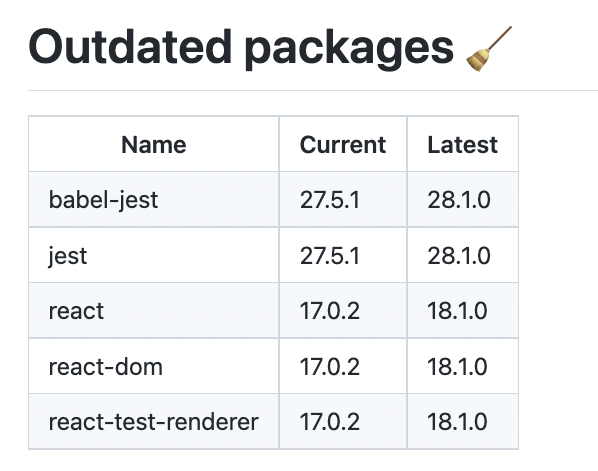

# `npm-outdated-action`

A composite action for GitHub Actions that runs `npm outdated --json` and prints the result to summary.

## Prerequisites

- `npm` v8 / v7

## Usage

```yaml
uses: gh640/npm-outdated-action@v1
```

With `cwd` set:

```yaml
uses: gh640/npm-outdated-action@v1
with:
  cwd: ./src
```

## Sample screenshots


